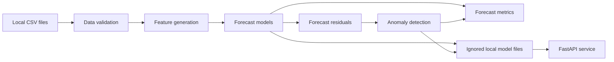

# Architecture

The platform is organized as a small Python package with separate modules for ingestion, feature engineering, modeling, anomaly detection, evaluation, monitoring helpers, training, and API serving.

## Module Responsibilities

- `data`: reads local CSV files, validates timestamps and numeric measurements, checks duplicate `(zone, timestamp)` pairs, and returns sorted data frames.
- `features`: creates calendar, load lag, rolling, weather, and forecast target columns.
- `models`: trains baseline regressors and persists model bundles with versioned metadata.
- `anomaly`: scores residual z-scores and supports IsolationForest for feature-based anomaly detection.
- `evaluation`: computes forecast and anomaly metrics and writes local JSON metrics.
- `training`: provides the command-line pipeline for local training and evaluation.
- `api`: exposes health, forecast, anomaly, and batch prediction endpoints.
- `monitoring`: computes lightweight reference statistics and drift summaries.

## Runtime Artifacts

Training outputs are written to ignored local folders such as `models/` and `reports/metrics/`. Raw data, processed data, trained models, and metrics are intentionally excluded from version control.
