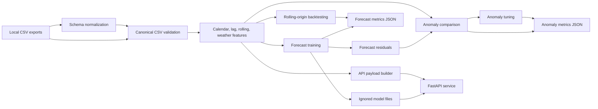

# Architecture

The platform is a small local-first Python package. It separates ingestion, feature generation,
modeling, anomaly detection, evaluation, API serving, and lightweight monitoring helpers.

## Component Responsibilities

- `data`: validates canonical CSV files and normalizes real local exports into the canonical
  schema.
- `features`: creates calendar, load lag, rolling, weather, and forecast target columns.
- `models`: trains Ridge or RandomForestRegressor baselines and persists model bundles.
- `anomaly`: scores residual z-scores, robust residual scores, and IsolationForest outputs.
- `evaluation`: computes metrics, runs rolling backtests, compares anomaly methods, and tunes
  anomaly settings.
- `training`: provides the local training pipeline with chronological or random split support.
- `api`: exposes health, forecast, anomaly, and batch prediction endpoints, and builds sample
  request payloads.
- `monitoring`: computes lightweight reference statistics and drift summaries.

## Runtime Artifacts

Raw data, processed data, trained models, metrics JSON, request payloads, figures, and reports are
written to ignored local paths such as `data/`, `models/`, and `reports/`. The repository keeps the
code, configuration, documentation, and tiny synthetic tests only.
